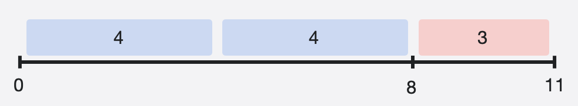

# [Конспект] 2. Базовые операторы

## Операторы для числовых типов

### Унарный минус

Унарный минус меняет знак числа. Он добавляется непосредственно перед значением, над которым он работает, без пробелов.

```swift
let three = 3
let minusThree = -three       // minusThree равно -3
let plusThree = -minusThree   // plusThree равно 3
```

### Арифметические операторы

Swift поддерживает четыре стандартных оператора для всех типов чисел:

- Сложение ( + )
- Вычитание ( - )
- Умножение ( * )
- Деление ( / )

```swift
1 + 2       // = 3
5 - 3       // = 2
2 * 3       // = 6
10.0 / 2.5  // = 4.0
```

⚠️ Будь внимателен, любое деление на 0 приведет к аварийному завершению программы.

**Особенности деление для типа Int**

⚠️ Если в результате деления ( / ) у типа Int образуется дробная часть, то он ее отбрасывает, сохраняя только целое значение.

Отдельно у типа Int есть оператор остатка от деления ( % ). Этот оператор наоборот отбрасывает целое число и берет остаток от деления. Рассмотрим деление 11 на 4. В 11 помещается 2 раза по 4. Остаток от деления – это оставшееся число до делимого, то есть 3.



```swift
11 / 4 // = 2
4 / 3 // = 1
5 / 3 // = 1

11 % 4 // = 3
4 % 3 // = 1
5 % 3 // = 2
```

Не скажу, что оператор остатка от деления используется очень часто, тем не менее знать о нем полезно. Представь, что нужно узнать является ли число четным? Для этого как раз нам нужно взять остаток от деления на 2. Если остаток равен 0, то число четное.

```swift
let value = 12
let isEven = value % 2 == 0

// value % 2 – возвращает остаток от деления на 2
// ... == 0 – сравнивает остаток с нулем
```

Обрати внимание, что сначала выполняются все арифметические операторы, а только потом оператор сравнения.

### Составные операторы присваивания

Иногда нужно произвести с переменной арифметическую операцию, а результат положить обратно в переменную. Для этого можно написать такой код

```swift
var value = 0
value = value + 1 // Увеличиваем value на 1
```

Но можно написать компактнее

```swift
var value = 0
value += 1 // Увеличиваем value на 1
```

Выражение `value += 1` является сокращением от `value = value + 1`. По сути, сложение и присваивание объединяются в один оператор, который выполняет обе задачи одновременно.

Составные операторы работают со всеми арифметические операторами `+=` , `-=` , `*=` , `/=` , `%=` .

### Приоритет операторов

Операторы имеют такой же приоритет, как и в математике. Приоритет можно переопределить с помощью скобочек.

```swift
2 + 2 * 2 // = 6
(2 + 2) * 2 // = 8
```

### Операторы сравнения

Swift поддерживает операторы сравнения:

- равно (а == b)
- не равно (a != b)
- больше, чем (a > b)
- менее (а < б)
- больше или равно (a >= b)
- меньше или равно (a <= b)

Каждый из операторов сравнения возвращает значение Bool, указывающее, верно ли утверждение.

```swift
1 == 1   // true потому что 1 равен 1
2 != 1   // true потому что 2 не равен 1
2 > 1    // true потому что 2 больше 1
1 < 2    // true потому что 1 меньше 2
1 >= 1   // true потому что 1 больше или равен 1
2 <= 1   // false потому что 2 не меньше или равно 1
```

## Операторы для строковые типов

### Сравнение строк

Типы String и Character поддерживают операторы сравнения:

- равно (a == b)
- не равно (a != b)

Причем при проверке, строки проверяется посимвольно. Строки будут равны, если все символы в них совпадут.

```swift
"Москва" == "Москва" // true
"Привет" == "привет" // false, потому что П и п разные буквы
" машина" != "машина" // true, строки разные, потому что в начале первой строки дополнительный пробел
```

### Сложение строк

Сложение строк еще называют – конкатенацией (concatenation). Этот оператор доступен только для String. 

```swift
"Привет" + "мир" // = "Приветмир"
"Привет " + "мир" // "Привет мир"
"Привет" + " " + "мир" // "Привет мир"
```

### Интерполяция строк

Интерполяция строк — это способ создания строки String из смеси констант, переменных, литералов и выражений путем включения их значений в строковый литерал.

```swift
let name = "Игорь"
let age = 25
let message = "Меня зовут \(name), мне \(age)"
// message содержит "Меня зовут Игорь, мне 25"
```

## Операторы для логического типа (Bool)

### Оператор НЕ

Логический оператор НЕ ( ! ) инвертирует логическое значение так, что true становится false, а false становится true.

```swift
!false // = true
!true // = false
```

### Оператор И

Чтобы выражение с логическим оператором И ( && ) было true, нужно чтобы **ОБА** операнда были true.

```swift
true && true // = true
true && false // = false
false && false // = false
```

### Оператор ИЛИ

Чтобы выражение с логическим оператором ИЛИ ( || ) было true, нужно чтобы **ХОТЯ БЫ ОДИН** из операндов был true.

```swift
true || true // = true
true || false // = true
false || false // = false
```

### Приоритет логических операторов

Наивысший приоритет имеет оператор НЕ ( ! ).

Далее по приоритетности операторы && и ||, они имею одинаковый приоритет и выполняются слева направо. Однако порядок можно переопределить с помощью скобочек.

```swift
false && false || true // true
false && (false || true) // false
```
