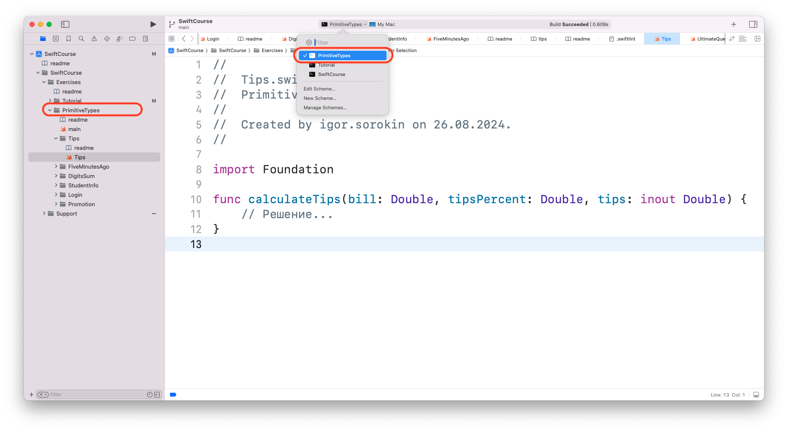
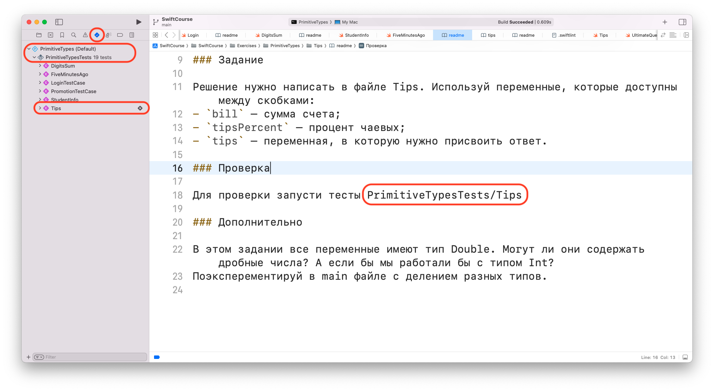

# Процесс решения задач ✅

Перед решением задач по какой-то теме посмотри все прериквизиты к этой теме. Они будут написаны в описании к теме (в readme файле в директории с темой). 

Рекомендую решать задачи и проходить темы по порядку, потому что они расположены в проекте по возрастанию сложности. 

### Проверка задач 

В описании каждой задачи указано какие тесты нужно запустить для ее проверки. 

Для запуска тестов нужно:

1. выбрать схему соответствующую разделу (название схемы должно совпадать с названием темы) 
 
 
 
2. в Navigator перейти во вкладку Test navigator и нажать кнопку «Запустит тесты» напротив нужного теста 

